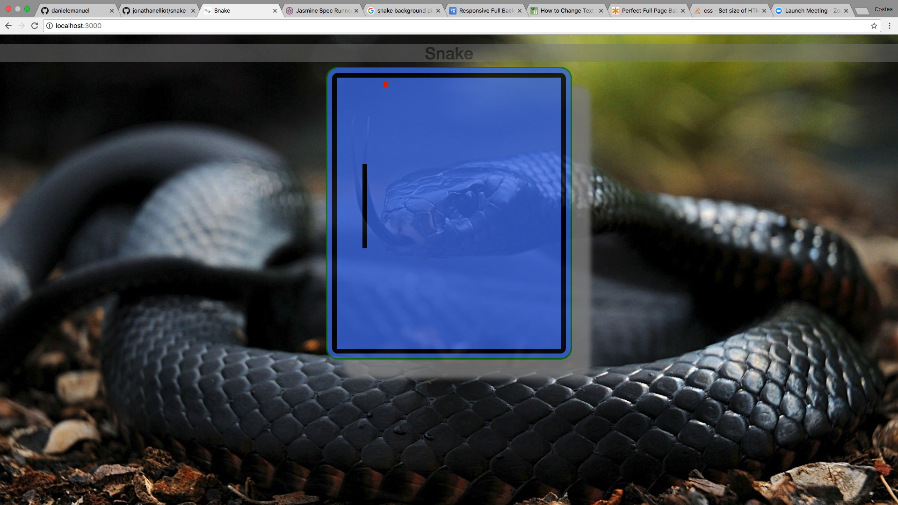

# Snake

### About
Our group's first exposure to writing a HTML game in Javascript. The classic game Snake.




---
## Visit our Heroku site
https://snakeymcsnakeface.herokuapp.com/

## Or run locally
View the repository [here](https://github.com/jonathanelliot/snake) on GitHub

Clone the repo. Then:

```bash
npm install

```

### To view in browser
```bash
npm run start:dev
```
Visit localhost:3000 in your web browser

---

### Controls

Use the arrow keys to control the snake(green) and pick up the food(red). Try and make the snake as long as possible! Don't hit the walls or yourself or GAME OVER!

---

## Processes
* XP (Extreme Programming)
* Agile
* Pair programming
* Remote collaboration

---
## Technologies used

* [Javascript](https://www.javascript.com/) for the game script
* [Express-Generator](https://expressjs.com/en/starter/generator.html) to build our framework
* [GitHub](https://github.com/jonathanelliot/snake) for storing our work
* [Waffle](https://waffle.io/) for tracking and organising workflow
* CSS to make it look pretty
* Git for version managing
